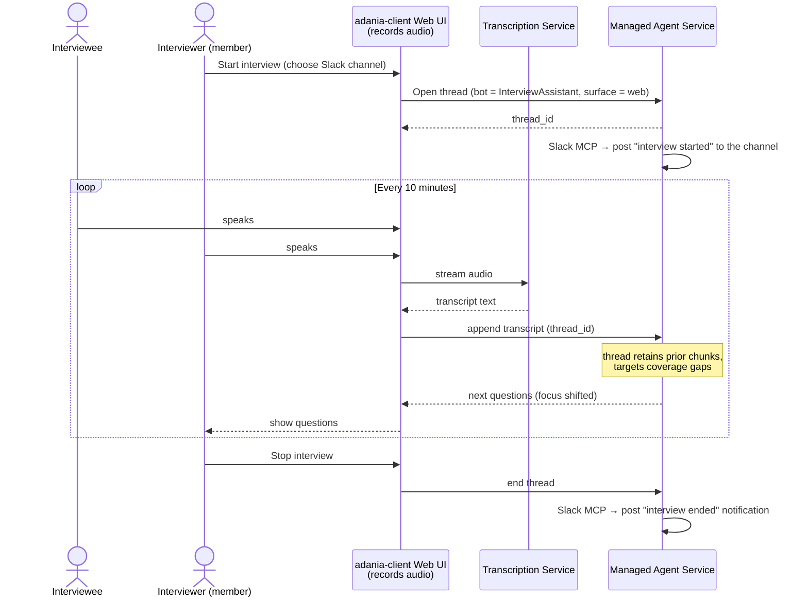

# adania-client

A separate **web UI** (not deployed — design/mock only) that lets **provisioned org users** (including non-owner **members**) log into their Adania account and use **managed bots over a new "web ui" surface**. First concrete agent: **InterviewAssistant**.

This folder is **analysis + mock only**. Nothing here is wired to the real `adania` backend.

- `mockup.html` — open in a browser. A clickable mock of the adania-client for an org **member** (the interviewer) with a **single** available agent, *InterviewAssistant*. Shows login → agent → live interview (recording + rolling transcript + questions that refresh every 10 min + Slack notify on start/stop).
- `INCONSISTENCIES.md` — where the brief / the two sequence diagrams / the existing `adania` repo disagree, with file:line refs and reconciliations. **Read this first.**

## What the brief asks for (captured, not built)
- A **"web ui" surface** for managed bots (a 4th surface alongside slack/linear/github) — **app-less**: the client is inside the org's Cognito trust boundary and talks to the runtime directly (no external app/webhook/install).
- Login for **provisioned org users incl. members** (reuse the Cognito *customers* pool).
- The agent is **not @-mentionable** on github/linear/slack — it's reached only from this web UI.
- **InterviewAssistant** with **Slack MCP tools** in its config: posts **on behalf of the human interviewer** to a **web-UI-configured channel** when an interview **begins**, and a **notification** when it **ends**.
- On **first managed-agent init**, create an **`adania-resources`** repo in the org's GitHub org (see `INCONSISTENCIES.md` §D — ambiguous; recommend org-level provisioning, not per-member).
- The interviewer is a **member** (not the org owner).

## Minimal interview sequence (the consistent model)

Differences from the **detailed** diagram in the brief (and why): that one used a native **Mac app** that **transcribes locally**. A browser web UI can *record* but live local transcription is heavy/inconsistent — so transcription is its own service actor here. See `INCONSISTENCIES.md` §A.

## How it would attach to the real backend (future, not built)
- **Login:** NextAuth → the existing **`cognito-customers`** pool (members resolve via `requireOrganization`).
- **Bots list:** a new authed `GET /api/bots` (org-membership-scoped) — does not exist yet.
- **Open/append/stream a thread:** a new authed `POST /api/bots/[botId]/session` + message append, keyed into the **existing** surface-generic `web.bot_thread` with `surface="web"`. The unauthed demo `/api/sessions(/[runId]/messages)` is **not** safe for a browser.
- **Slack notify:** either the org **bot token** (post as the bot, ship-now) or a **per-member Slack vault + `/api/mcp/slack`** (post truly as the interviewer, net-new — mirrors the GitHub MCP).
- **Channel config:** stored on the bot, picker fed by the org Slack bot token, exposed as a **member-allowed** setting.

> The platform pitch: build software serving many tenants in the interviewer's domain; the expert interviewer is the prime high-experience tenant. The InterviewAssistant is the first vertical; the **web ui** surface + per-member Slack act-as-self are the reusable platform additions it forces.
